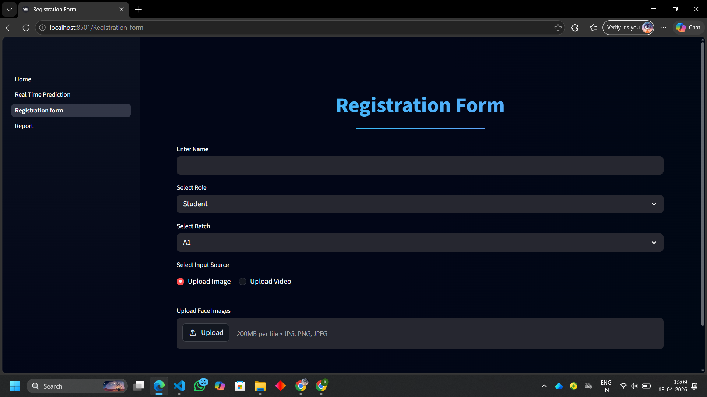
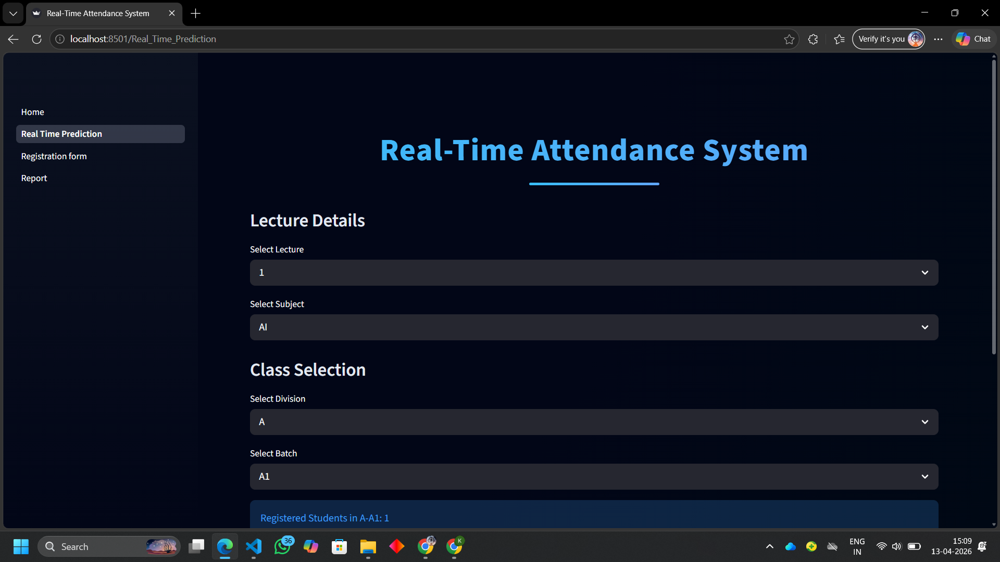
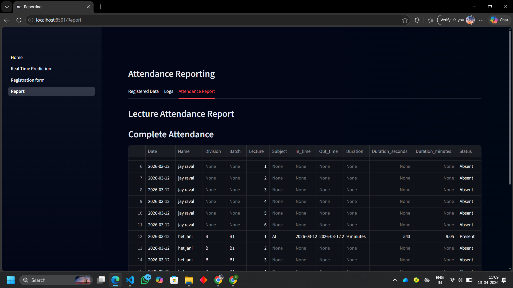

#  AI Attendance System

### Smart Face Recognition-Based Attendance Using AI

<p align="center">
  
  
  
  
  
</p>

---

##  Overview

This project is an **AI-powered attendance system** that uses **real-time face recognition** to automate attendance tracking.

###  Why this project?

* Eliminates manual entry
* Prevents proxy attendance
* Provides **real-time tracking + detailed reports**

---

##  Features

###  Core Features

*  Real-time face detection & recognition
*  Multi-source input:

  * Webcam
  * Phone Camera (IP Webcam)
  * Video Upload
  * Image Upload
  * Automatic attendance logging

### Intelligent System

* Uses **InsightFace (buffalo_sc)** model
* Cosine similarity for accurate matching
* Handles unknown faces gracefully

###  Registration Module

* Register using:

  * Multiple images
  * Video input
* Stores embeddings in **Redis**
* Supports:

  * Name
  * Role (Student/Teacher)
  * Division & Batch

### Reporting Dashboard

* View:

  * Registered users
  * Raw logs
  * Final attendance report

* Includes:

  * In-Time / Out-Time
  * Duration tracking
  * Present / Absent logic
  * Filtering system

---

## System Architecture

```
Camera/Input → Face Detection → Embedding → Matching → Redis → Reports
```

---

## Project Structure

```
AI-Attendance-System/
│── app.py                 # Main Streamlit application (entry point)
│── face_rec.py            # Core AI logic (face recognition + Redis)
│── phone_camera.py        # Connect mobile camera (IP webcam)
│── video.py               # Video-based face detection
│── test_phone_cam.py      # Testing phone camera connection
│── upload_logs.py         # Upload and manage attendance logs

│── pages/                 # Streamlit multi-page modules
│   ├── 1_Real_Time_Prediction.py   # Live attendance system
│   ├── 2_Registration_form.py      # User registration module
│   ├── 3_Report.py                 # Attendance reporting dashboard

│── assets/                # Images, screenshots, demo files
│   ├── dashboard.png
│   ├── detection.png
│   ├── report.png

│── .gitignore             # Git ignore rules
│── README.md              # Project documentation
```


##  Tech Stack

| Category        | Technology    |
| --------------- | ------------- |
| Language        | Python        |
| UI              | Streamlit     |
| Computer Vision | OpenCV        |
| AI Model        | InsightFace   |
| Database        | Redis         |
| Data Processing | Pandas, NumPy |

---

##  Workflow

###  Registration

* Upload images/video
* Extract embeddings
* Store in Redis

### Detection

* Capture live frames
* Detect faces
* Match embeddings

###  Logging

Stored format:

```
Name@Role@Lecture@Subject@Timestamp
```

### Reporting

* Generate attendance report
* Calculate duration
* Mark status automatically

---

##  Attendance Logic

| Duration | Status    |
| -------- | --------- |
| < 5 min  |  Absent  |
| ≥ 5 min  |  Present |

---

## Installation

```bash
git clone https://github.com/your-username/AI-Attendance-System.git
cd AI-Attendance-System
pip install -r requirements.txt
streamlit run Home.py
```

---

##  Demo

> Add screenshots inside `assets/` folder

```
assets/
│── dashboard.png
│── detection.png
│── report.png
```

Then use:

```md



```
---

## 🔮 Future Enhancements

* 🔐 Authentication system
* 📱 Mobile app integration
* ☁️ Cloud deployment
* 📥 Export to Excel / PDF
* 📊 Analytics dashboard

---

## Resume Value

This project demonstrates:

* AI + Computer Vision
* Real-time processing
* Database integration
* Full-stack development

 Ideal for:

* AI/ML Internships
* Software Engineering roles

---
